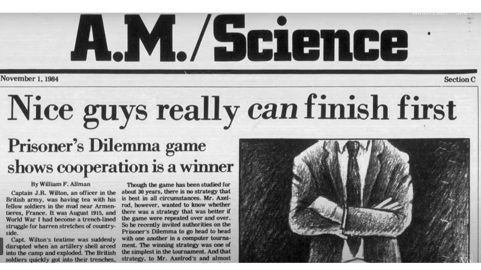
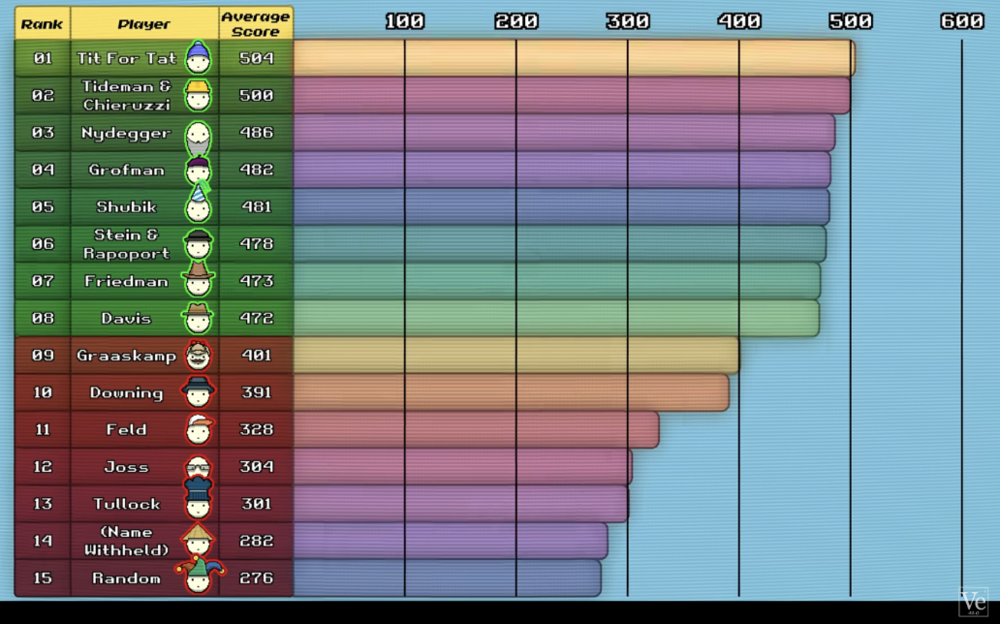
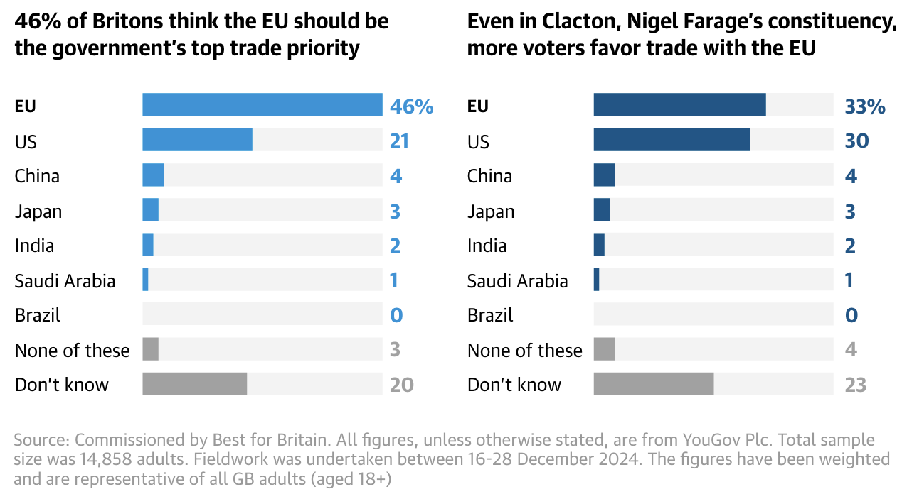

# La théorie des jeux :

##### Une science des choix stratégiques, des fondamentaux à l’intelligence artificielle

La théorie des jeux est l’étude mathématique des décisions interdépendantes. Née au croisement des mathématiques, de la psychologie et de la stratégie militaire, elle répond à une question universelle : **comment agir lorsque le résultat dépend des choix des autres** ?

Ses origines remontent aux travaux de John von Neumann et Oskar Morgenstern, qui publient en 1944 _Theory of Games and Economic Behavior_. À l’époque, le contexte géopolitique – course à l'armement, Guerre froide – exige des outils pour modéliser des conflits où chaque acteur anticipe les réactions de l’adversaire. Von Neumann y parvient en formalisant des concepts comme les jeux à somme nulle - où un gagnant implique un perdant - et le théorème du minimax, une stratégie pour minimiser ses pertes maximales.

Au fil du temps, ces concepts se sont progressivement émancipés du strict cadre militaire, pour se déployer dans des domaines aussi variés que l’économie, la biologie ou la politique tarifaire de Donald Trump[^1]  


# Fondements et concepts clés de la théorie
### Les éléments d’un jeu :
---
Un jeu en théorie des jeux est caractérisé par :
- **Des joueurs** : Chaque participant prend des décisions stratégiques en fonction des règles du jeu.
- **Des stratégies** : Un ensemble d’actions possibles pour chaque joueur.
- **Des paiements** : Les gains ou pertes associés aux décisions des joueurs.
- **Une information disponible** : Selon le type de jeu, les joueurs peuvent avoir une connaissance parfaite ou imparfaite des décisions passées.
### Les types de jeux :
___
- **Jeux coopératifs vs. non coopératifs**
    - **Coopératifs** : Les joueurs peuvent former des coalitions et coopérer pour maximiser un bénéfice commun.
    - **Non coopératifs** : Chaque joueur prend des décisions indépendantes pour maximiser son propre gain.
- **Jeux à somme nulle vs. jeux à somme non nulle**
    - **À somme nulle** : Le gain d’un joueur est exactement compensé par la perte de l’autre (ex : poker, échecs).
    - **À somme non nulle** : Les joueurs peuvent tous gagner ou perdre simultanément, selon leurs interactions (ex : commerce international, négociations diplomatiques).
- **Jeux finis vs. jeux infinis**    
    - **Jeux finis** : Nombre limité de stratégies et de tours (ex : un match de tennis).
    - **Jeux infinis** : Un jeu sans fin prédéfinie, où l’objectif est d’optimiser la performance sur le long terme (ex : marché boursier, négociation continue).
- **Jeux à information parfaite vs. information imparfaite**
    - **Information parfaite** : Tous les joueurs connaissent les actions précédentes de leurs adversaires (ex : échecs).
    - **Information imparfaite** : Certains éléments restent cachés aux joueurs, qui doivent prendre des décisions dans l’incertitude (ex : poker).
- **Jeux simultanés vs. séquentiels**
    - **Simultanés** : Les joueurs prennent leurs décisions en même temps, sans connaître celles des autres (ex : pierre-papier-ciseaux).
    - **Séquentiels** : Chaque joueur joue à tour de rôle et peut observer les décisions des autres avant d’agir (ex : jeu d’échecs).
 
### Joueurs  
___
Les joueurs sont les éléments fondamentaux d'un jeu. Ils participent à une interaction avec l’objectif d’atteindre certains résultats. L’interaction entre les joueurs peut être classée en deux grandes catégories : coopérative et non coopérative. Un jeu peut impliquer deux joueurs ou plus. Dans un jeu coopératif, les joueurs visent toujours à maximiser le gain global du groupe.

### Stratégies et interactions entre joueurs
___
Dans un jeu, une **stratégie** est une **séquence d’actions** qu’un joueur peut choisir tout au long du jeu. L’objectif des joueurs est de **trouver la stratégie optimale** qui maximise leur gain tout en anticipant les décisions des autres.

### Paiements
___
Les **paiements** représentent les gains ou pertes associés aux décisions prises.
- Dans un **jeu coopératif**, les joueurs cherchent à **maximiser un gain commun**.
- Dans un **jeu non coopératif**, chaque joueur cherche à **optimiser son propre gain**, sans nécessairement prendre en compte celui des autres.

La fonction de paiement est définie par les règles du jeu et peut varier selon **les choix des adversaires et les conditions initiales**.
### Meilleure réponse
___
Une stratégie de meilleure réponse correspond au choix optimal d’un joueur en fonction des stratégies de ses adversaires. En général, un joueur préfère toujours adopter une stratégie qui constitue une meilleure réponse. L’équilibre de Nash (NE) est déterminé en fonction des meilleures réponses des joueurs.
### Équilibre de Nash  
___
Un équilibre de Nash est une situation où aucun joueur ne peut améliorer son gain en changeant unilatéralement sa stratégie. Le dilemme du prisonnier illustre ce concept, où deux individus choisissent de trahir ou de coopérer, avec des résultats dépendants des
choix mutuels.

**Le dilemme du prisonnier :**

- Deux joueurs doivent choisir entre **coopérer** ou **trahir**.
- L’équilibre atteint **n’est pas toujours optimal pour eux**, car chacun agit dans son intérêt propre sans considérer le gain collectif.

| Joueur A ↓/ Joueur B → | Coopère (C) | Trahit (D) |
| ---------------------- | ----------- | ---------- |
| **Coopère (C)**        | (3,3)       | (0,5)      |
| **Trahit (D)**         | (5,0)       | (1,1)      |

## Nice guys finish first  [^2]
___


**Nice, Provocative, Forgiving.**[^3]
Ce sont les trois adjectifs qui définissent la stratégie **Tit for Tat (soit Donnant Donnant)** soumises par Anatol Rapoport - psychologue travaillant principalement sur la résolution de conflit et la paix - au tournoi organisé par Robert Axelrod en 1979[^4]. Ce tournoi a fait jouer entre elles différentes stratégies soumises par des professeurs d’université de domaine divers, dans des dilemmes du prisonnier itérés. La stratégie qui remporte à deux reprises ces tournois est l’une des plus simples : **Tit for Tat**.

 [^5]

Les résultats de ces tournois nous enseignent les leçons suivantes :
- Il est essentiel d’être **gentil** (_Nice_). En effet, commencer par coopérer, sans chercher à manipuler ou à tromper l'autre joueur, est la meilleure manière d'optimiser son score à long terme. Lors du premier tournoi, toutes les stratégies coopératives – représentées en vert dans le tableau ci-dessus – ont surpassé les stratégies malhonnêtes. Ce constat a incité Richard Dawkins à ajouter un chapitre à son ouvrage _The Selfish Gene_, offrant une justification logique à la coopération dans la nature.
- Il est crucial d’être **provocable** (_Provocative_). Une bonne stratégie ne doit pas tolérer l’exploitation : répondre immédiatement à une défection par une réciproque à la prochaine interaction permet de dissuader les comportements opportunistes et de protéger ses intérêts.
- Enfin, il est important d’être **clément** (_Forgiving_). Après une trahison, il est essentiel de savoir revenir à la coopération dès que l'autre partie adopte de nouveau un comportement coopératif. Cette capacité à pardonner favorise la restauration de la confiance et le maintien d’une relation bénéfique à long terme.

Ce comportement peut être résumé en quelques lignes de code [^6]: 
```python
def strategy(self, opponent: Player) -> Action:
    if not self.history:
        return C
    if opponent.history[-1] == D:
        return D
    return C
```

___  
 L’application de **Tit for Tat** dans un **dilemme du prisonnier itéré** suit la logique suivante :

| **Tour** | **Joueur A (Tit for Tat)** | **Joueur B** | **Résultat (A, B)** |
| -------- | -------------------------- | ------------ | ------------------- |
| 1        | C                          | C            | (3,3)               |
| 2        | C                          | D            | (0,5)               |
| 3        | D                          | C            | (5,0)               |
| 4        | C                          | C            | (3,3)               |
| 5        | C                          | C            | (3,3)               |

Au **premier tour**, **Tit for Tat commence toujours par coopérer** (C). Si son adversaire trahit (D), elle riposte immédiatement en trahissant au tour suivant. Dès que l’autre joueur revient à la coopération, **Tit for Tat pardonne** et coopère de nouveau, favorisant ainsi une stabilité à long terme.
Grâce à cette approche **réciproque et adaptative**, **Tit for Tat**. Elle **sanctionne les comportements opportunistes**, mais **favorise la coopération durable**
## Exemples de la théorie des jeux dans les relations internationales 
### Le retour du Royaume-Uni dans l’UE
___

Les récents sondages montrent un certain regret parmi les Britanniques, dont une partie souhaiterait aujourd’hui se rapprocher davantage de l’UE que des États-Unis. Cependant, si vous poseriez cette question à votre entourage, une réponse fréquente pourrait être un **"Non" catégorique**, justifié par des arguments économiques, historiques ou simplement par une réaction d’orgueil politique. Ce refus instinctif peut être interprété comme l’application de stratégies punitives issues du dilemme du prisonnier itéré.


[^7]
Dans cette situation, on peut modéliser le jeu entre l’UE (Joueur 1) et le Royaume-Uni (Joueur 2) en utilisant les stratégies classiques de la théorie des jeux après une défection initiale :

- **La stratégie du Grim Trigger (rancune absolue)** : une fois la trahison constatée, toute future coopération est refusée définitivement. L’UE pourrait alors rejeter catégoriquement toute demande de réintégration, considérant que la confiance a été rompue de manière irréversible.
- **La stratégie du Grudger (rancune durable mais réversible)** : l’UE pourrait initialement sanctionner le Royaume-Uni, mais à condition de voir des signes de bonne volonté, elle pourrait envisager une réouverture progressive des discussions.
- **La stratégie du Forgetful Grudger (rancune atténuée avec le temps)** : ici, l’UE pourrait appliquer une punition temporaire en rejetant les premières approches du Royaume-Uni, mais finirait par oublier la défection passée et accepter de reprendre les négociations après un certain laps de temps.

Cependant, il serait intéressant d'examiner rationnellement, dans ce contexte, la stratégie Tit for Tat. Plutôt que de répondre par une sanction définitive ou un ressentiment prolongé, l’Union européenne pourrait considérer qu’il est dans son intérêt de rétablir immédiatement la coopération. Accepter sans condition le retour du Royaume-Uni pourrait être perçu comme un choix pragmatique, fondé sur l’idée qu’une réconciliation rapide maximiserait les bénéfices mutuels. Ainsi, pardonner une trahison passée pourrait être la manière la plus efficace de recréer un environnement bénéfique aux deux parties, évitant ainsi un cycle de méfiance et de représailles.

Si l’approche Tit for Tat présente un intérêt stratégique dans certaines interactions, elle atteint ses limites face à des dynamiques plus complexes où les acteurs ne suivent pas de règles fixes ou prévisibles. Dans le cas des relations entre l’Union européenne et le Royaume-Uni, une stratégie strictement réactive pourrait ne pas être optimale à long terme, notamment si les interactions futures impliquent des ajustements progressifs et des négociations stratégiques.

**Tit for Tat** constitue une stratégie efficace dans des interactions simples et répétées, elle montre ses limites lorsque les situations deviennent plus complexes ou marquées par une incertitude accrue. Dans des contextes où les intérêts des acteurs peuvent évoluer et où les décisions s'inscrivent dans des dynamiques multidimensionnelles et à long terme, une approche strictement réactive peut se révéler trop rigide. Se limiter à une logique de réciprocité immédiate pourrait ne pas suffire face à des enjeux nécessitant des compromis progressifs, une vision stratégique plus large et la capacité d’anticiper les comportements futurs.

L’étude "When Machine Learning Meets AI and Game Theory"[^8] d’Agrawal et Jaiswal illustre comment un algorithme d’apprentissage automatique permet d’aller au-delà de la simple réciprocité en intégrant des éléments d’adaptation et d’anticipation. Plutôt que de répondre mécaniquement à chaque action adverse, un modèle basé sur l’apprentissage par renforcement apprend à maximiser ses gains sur le long terme en ajustant son comportement en fonction d’un historique élargi et en identifiant les tendances sous-jacentes des décisions adverses.

Cette approche fondée sur l’apprentissage et l’adaptation ne se limite pas aux interactions stratégiques entre agents humains. Elle constitue également le fondement des avancées en intelligence artificielle, où la capacité à identifier des schémas complexes et à ajuster les décisions en fonction de données en constante évolution est essentielle. C’est précisément dans ce cadre que s’inscrit le **deep learning**.

## Deep learning
___
Le deep learning est une branche avancée du machine learning reposant sur des réseaux de neurones artificiels et différentes méthodes d’apprentissage : supervisé, non supervisé et par renforcement. Ces modèles exploitent des architectures complexes, composées de plusieurs couches neuronales, pour extraire des caractéristiques pertinentes à partir de données brutes. Aujourd’hui, le deep learning est appliqué dans de nombreux domaines, allant de la reconnaissance vocale à la vision par ordinateur, en passant par le traitement du langage naturel (NLP), l’analyse d’images médicales et même les jeux stratégiques.

Parmi les différentes approches du deep learning, deux modèles illustrent particulièrement bien l’application de la théorie des jeux :


1. **Le Deep Reinforcement Learning** (apprentissage par renforcement profond), notamment en contexte multi-agents. On y voit réapparaître des concepts comme le _Tit for Tat_ ou l’_Équilibre de Nash_ [^9], afin d’optimiser les décisions d’un agent qui doit interagir de manière dynamique avec son environnement.  

2. **Les Generative Adversarial Networks (GANs)**, où un générateur et un discriminateur s’affrontent dans un jeu compétitif à somme nulle.

## GANs
___  
Un tournant important a eu lieu en **2014**, lorsque **Ian Goodfellow et ses collègues [^10]** ont publié un article présentant ce qu’ils ont appelé les Generative Adversarial Networks (GANs).

### Le principe
___
Pour faire simple, un GAN met en scène deux « réseaux de neurones », qui « jouent » l’un contre l’autre :

- **Le générateur (Generator)** : il produit de fausses données, en essayant d’imiter le plus fidèlement possible de vraies données (images, textes, sons, etc.).  

- **Le discriminateur (Discriminator)** : il cherche à repérer les échantillons « synthétiques » pour les distinguer des vrais.

Cette confrontation évoque un **jeu à somme nulle** :  
- Si le générateur réussit à tromper le discriminateur, il « gagne ».  
- Si le discriminateur parvient à démasquer les faux, c’est lui qui gagne.

Goodfellow a ainsi montré que cette logique compétitive pouvait faire progresser simultanément les deux modèles : en s’adaptant l’un à l’autre, ils finissent par atteindre un équilibre où le générateur produit des échantillons quasiment indiscernables des données réelles.


### Une application directe de la théorie des jeux
___
Sans forcément plonger dans les détails mathématiques, on peut comprendre que les GANs sont modélisés comme un jeu minimax : chaque agent cherche à minimiser sa propre perte tout en maximisant son profit. Les liens avec la théorie des jeux [^11] sont donc très clairs :
le générateur cherche à duper le discriminateur (stratégie offensive), tandis que le discriminateur affine ses capacités de détection (stratégie défensive).

Au fil de l’entraînement, le système se rapproche d’un équilibre (souvent comparé à un « équilibre de Nash ») où ni le générateur ni le discriminateur ne peuvent améliorer leur performance en changeant de stratégie de façon unilatérale.

### Des usages multiples : entre création artistique et enjeux sociétaux
---
De façon plus concrète, les GANs permettent par exemple :

- **De générer des images ultra-réalistes** (visages, paysages, œuvres d’art imaginaires) soulevant des questions liées à l’authenticité, au droit d’auteur et à la propriété intellectuelle.  

- **De synthétiser des sons ou des voix** très proches de celles d’une personne réelle, ouvrant la voie à des imitations bluffantes, mais aussi à des escroqueries (l’« arnaque au président », le chantage audio, etc.).  

- **D’aider la recherche en psychologie ou sociologie** en créant des jeux de données artificiels, ce qui peut préserver la vie privée (données sensibles anonymisées) et multiplier les scénarios d’étude.  
- **D’améliorer la diversité des jeux de données** (_data augmentation_) afin d’entraîner d’autres algorithmes. Cela affine les analyses statistiques et les modèles prédictifs, même dans des domaines comme l’économie ou la santé publique.

Bibliographie :
Agrawal Anurag, et Deepak Jaiswal, « When Machine Learning Meets AI and Game Theory ».

Andersen Per-Arne et al., « Deep RTS: A Game Environment for Deep Reinforcement Learning in Real-Time Strategy Games », 2018.

Chivukula Aneesh Sreevallabh et al., « Adversarial Deep Learning Models with Multiple Adversaries », _IEEE Transactions on Knowledge and Data Engineering_ 31, no 6, 2019

Foerster Jakob N et al., « Learning with Opponent-Learning Awareness », 2018.

Hazra Tanmoy, et Kushal Anjaria, « Applications of Game Theory in Deep Learning: A Survey », 2022. 

Hounshell David, « The Cold War, RAND, and the Generation of Knowledge, 1946-1962 ». _Historical Studies in the Physical and Biological Sciences_ 27, no 2, 1997.

Kopelman Shirli, « Tit for Tat and Beyond: The Legendary Work of Anatol Rapoport ». _Negotiation and Conflict Management Research_ 13, no 1, 2020.

Leonard, Robert J., « From Parlor Games to Social Science: Von Neumann, Morgenstern, and the Creation of Game Theory 1928-1944 », _Journal of Economic Literature_ 33, no 2, 1995

Tembine Hamidou, « Deep Learning Meets Game Theory: Bregman-Based Algorithms for Interactive Deep Generative Adversarial Networks », _IEEE Transactions on Cybernetics_ 50, 2020
Sources

[^1]: « Trump threatens the grimp trigger ». Spotify, [URL](https://open.spotify.com/episode/0Sydu8cKghev1WEdIHvytw?si=525e8843c8d24ae0)
[^2]: Dawkins, Richard. *The Selfish Gene*, p. 241.
[^3]: Robert Axelrod: Why Being Nice, Forgiving, and Provokable are the Best Strategies for Life, YouTube, [URL](https://www.youtube.com/watch?v=7wVkXS821ig)
[^4]: Axelrod, Robert, « Effective Choice in the Prisoner’s Dilemma », *The Journal of Conflict Resolution*, vol. 24, no. 1, 1980, pp. 3–25. [URL](http://www.jstor.org/stable/173932) 
[^5]: Veritasium, « What Game Theory Reveals About Life, The Universe, and Everything », YouTube [URL](https://www.youtube.com/watch?v=mScpHTIi-kM&t=650s)
[^6]: Documentation « Tit for Tat » dans la bibliothèque Python *Axelrod*, [URL](https://axelrod.readthedocs.io/en/stable/_modules/axelrod/strategies/titfortat.html)
[^7]:  « Move closer to Europe – not Trump’ voters tell Starmer in major UK poll », The Guardian [URL](https://www.theguardian.com/politics/2025/jan/25/move-closer-to-europe-not-trump-voters-tell-starmer-in-major-uk-poll)
[^8]: Agrawal, Anurag et Deepakshi Jaiswal. « When Machine Learning Meets AI and Game Theory » (2012).
[^9]: Foerster, Jakob N. et al. « Learning with Opponent-Learning Awareness ». Adaptive Agents and Multi-Agent Systems (2017).
[^10]: Goodfellow, Ian J. et al. « Generative Adversarial Nets ». *Neural Information Processing Systems* (2014).
[^11]: Hazra, Tanmoy et Kushal Anjaria. « Applications of game theory in deep learning: a survey » (2022).

